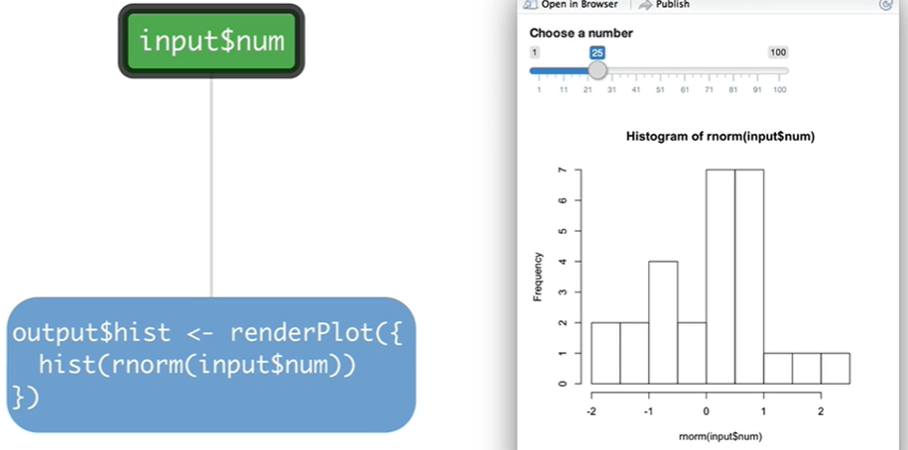

```{r, child="00-preamble.Rmd"}

```

## Reatividade: outro paradigma

Quando escrevemos código R, duas características estão sempre presentes:

--

- podemos avaliar uma linha de código assim que a escrevermos; e

--

- se decidirmos rodar todo o script de uma vez, as linhas de código serão avaliadas sequencialmente.

---
## Exemplo de script sequencial

```{r, eval = FALSE}
tab_starwars <- dplyr::starwars

tab_grafico <- tab_starwars |>
  tidyr::unnest(films) |> 
  tidyr::drop_na(species) |> 
  dplyr::group_by(films) |>
  dplyr::summarise(total_especies = dplyr::n_distinct(species)) |> 
  dplyr::mutate(
    films = forcats::fct_reorder(films, total_especies)
  )

tab_grafico |> 
  ggplot2::ggplot(ggplot2::aes(y = films, x = total_especies)) +
  ggplot2::geom_col() +
  ggplot2::theme_minimal() +
  ggplot2::labs(x = "Total de espécies", y = "Filme")
```

--

Esse paradigma é conhecido como **programação imperativa**.

---
## Programação declarativa

Na **programação declarativa**, os comandos não são executados imediatamente. Nosso código funciona como uma receita, que só será utilizada quando necessário.

--

No contexto do Shiny, a nossa receita é transformada em um **diagrama de reatividade**, isto é, um diagrama de dependências que decide quais outputs devem ser recalculados quando um input muda.

--

O diagrama de reatividade de um shiny app possui 3 estruturas: 

- **valores reativos**

- **funções observadoras**

- **expressões reativas**

---
## Valores reativos

Os valores reativos são **a origem do diagrama de reatividade**. Eles têm o papel guardar valores e disparar um *aviso* sempre que essas valores mudam.

--

Os valores da lista `input` são um exemplo de valor reativo.

---
## Funções observadoras

As funções observadoras são **o ponto final do diagrama de reatividade**. Elas têm o papel de capturar os avisos enviados pelos valores reativos e recalcular os seus próprios valores, a partir do código definido dentro delas.

--

As funções `render*()` são um exemplo de **funções observadoras**.

---
## Um exemplo simples

```{r, echo = FALSE, out.width="70%"}

```

---
## Expressões reativas

Muitas vezes, um aplicativo shiny precisa de passos intermediários, entre um valor reativo e uma função observadora.

--

Precisamos de uma estrutura que receba um valor reativo, faça alguma conta e devolva um resultado, um valor também reativo que será utilizado posteriormente em uma função observadora.

--

Essas estruturas são as **expressões reativas**. Para criá-las, podemos utilizar as funções `reactive()` e `eventReactive()`.

