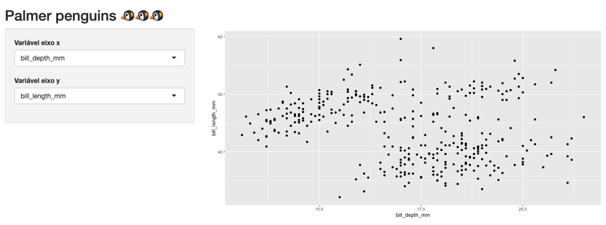

```{r, child="00-preamble.Rmd"}

```

## Inputs e Outputs

Uma das principais tarefas no desenvolvimento de um Shiny app é a definição e construção dos inputs e outputs. São esses elementos que nos permitem interagir com o app.

```{r, echo = FALSE}

```

---
## Inputs

Inputs representam as entradas do nosso aplicativo, isto é, a maneira como informações são transmitidas entre a pessoa usando o app e o servidor. Essas informações podem ser valores, textos, datas, arquivos ou até mesmo cliques em um botão.

--

Para facilitar a escolha desses valores, o pacote `shiny` possibilita diversas opções de *widgets*, a depender do tipo de valor a ser passado.

--

Você pode conferir a lista de widgets do pacote `shiny` [nesta página](https://shiny.rstudio.com/gallery/widget-gallery.html).

---
## Funções \*Input() e \*Button()

Para criar esses widgets utilizamos as famílias de funções `*Input()` ou `*Button`.

--

Todas essas funções possuem `inputId` como primeiro argumento, que recebe uma string e será utilizado para acessar o valor de cada input dentro da função `server`, a partir da lista `input`.

--

Isso implica que **dois inputs não podem ter o mesmo `inputId`**!

---
## Outputs

Outputs representam as *saídas* do nosso aplicativo, isto é, tudo que queremos que nosso código R retorne para o usuário. Essas saídas podem ser tabelas, gráficos, mapas, texto, imagens ou qualquer outro elemento em HTML.

---
## Funções *Output()

Para gerar um output, precisamos informar **onde** ele aparecerá e **como** ele será criado.

--

Para definir que um output existe e posicioná-lo na UI, utilizamos na UI uma função da família `*Output()`. 

--

Todas essas funções possuem `outputId` como primeiro argumento, que recebe uma string e será utilizado para criar o output dentro da função `server`, a partir da lista `output`. Os Ids devem ser únicos!

--

Veja as principais funções dessa família:

```{r, echo = FALSE, eval=TRUE, out.width="100%"}
tibble::tribble(
  ~Função, ~`Saída`,
  "plotOutput()", "Gráficos",
  "tableOutput()", "Tabelas",
  "textOutput()", "Textos",
  "uiOutput()", "Elementos HTML (UI)"
) |>
  reactable::reactable(
    sortable = FALSE
  )
```

---
## Funções render*()

Para passar ao shiny o código que gera um output, utilizamos no server uma função da família `render*()`.

Na grande maioria dos casos, teremos o par `visualizacaoOutput()` (na UI) e `renderVisualizacao()` (no server).

--

Veja a seguir as principais funções `render*()` e como elas se comunicam com as funções `*Output()`.

```{r, echo = FALSE, eval=TRUE}
tibble::tribble(
  ~`*Output()`, ~`render*()`,
  "plotOutput()", "renderPlot()",
  "tableOutput()", "renderTable()",
  "textOutput()", "renderText()",
  "uiOutput()", "renderUI()"
) |>
  reactable::reactable(
    sortable = FALSE
  )
```


---
## Gerando outputs

1. Colocamos uma função da família `*Output()` na UI.

--

2. O argumento `outputId` das funções `*Output()` é utilizado para nos referirmos aos outputs dentro do server. Todos os outputs criados ficarão dentro da lista `output`.

--

3. Escrevemos o código que gera esse output dentro de uma função da família `render*()` dentro do server.


