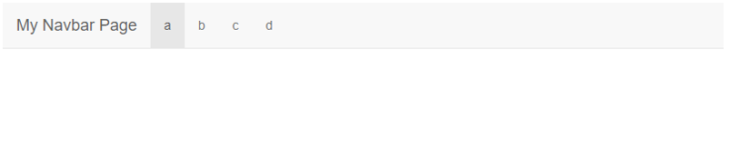

```{r, child="00-preamble.Rmd"}

```

## HTML

HTML é uma [linguagem de marcação](https://pt.wikipedia.org/wiki/Linguagem_de_marca%C3%A7%C3%A3o) para construir páginas web. 

Uma linguagem de marcação é apenas um tipo de documento que contem texto simples (como em um bloco de notas) e um conjunto de instruções para formatar (anotar, marcar) parte específicas do conteúdo. Além do HTML, o LaTeX e o (R) Markdown são outros exemplos comuns de linguagem de marcação.

A maior parte do esforço em aprender uma linguagem de marcação está em aprender quais são e como utilizar as instruções de formatação.

---

## Tags HTML

No HTML, as instrução de formatação são chamadas *tags*. Utilizaremos as *tags* para formatar qualquer elemento da página web que estamos criando. Com elas, podemos, por exemplo, transformar um texto em negrito ou itálico, criar títulos e inserir imagens. 

O pacote `shiny` traz diversas funções que simulam essas tags. As principais são:

```{r, echo = FALSE, eval=TRUE}
tibble::tribble(~`função`, ~`para que serve`,
                "a()", "cria um hiperlink",
                "hr()", "cria uma linha horizontal",
                "br()", "insere uma quebra de linha",
                "h1(), ..., h6()", "cria títulos",
                "img()", "insere uma imagem",
                "p()", "cria um parágrafo",
                "em()", "formata o texto em itálico",
                "strong()", "formata o texto em negrito") %>%
  reactable::reactable(
    sortable = FALSE
  )
```

---
## Tags HTML

O código Shiny abaixo, por exemplo, gera o código HTML a seguir.

```{r, eval = FALSE}
#ui
fluidPage(
  h1("Meu Primeiro Shiny App"),
  p("O link para o site do Shiny é ",
    a(href = "https://www.rstudio.com/shiny/", "rstudio.com/shiny."),
    strong("Recomendo fortemente que você dê uma olhada!"))
)
```

```{html}
<div class="container-fluid">
  <h1>Meu Primeiro Shiny App</h1>
  <p>
    O link para o site do Shiny é 
    <a href="https://www.rstudio.com/shiny/">rstudio.com/shiny.</a>
    <strong>Recomendo fortemente que você dê uma olhada!</strong>
  </p>
</div>
```

---
## Tags HTML

Que, por sua vez, gera o seguinte documento web:

```{html}
<!-- HTML -->
<div class="container-fluid">
  <h1>Meu Primeiro Shiny App</h1>
  <p>
    O link para o site do Shiny é 
    <a href="https://www.rstudio.com/shiny/">rstudio.com/shiny.</a>
    <strong>Recomendo fortemente que você dê uma olhada!</strong>
  </p>
</div>
```

```{r, echo = FALSE, results='asis'}
#ui
shiny::tagList(
  shiny::h1("Meu Primeiro Shiny App"),
  shiny::p(
    "O link para o site do Shiny é ",
    shiny::a(href = "https://www.rstudio.com/shiny/", "rstudio.com/shiny."),
    shiny::strong("Recomendo fortemente que você dê uma olhada!")
  )
)
```

---
## Atividade

Vamos ver um pequeno exemplo de como uma página web é construída em HTML.

<br>

<center>

<br>
<br>
`r blue('Ao RStudio: 11-exemplo-html.html')`
<center>

---
## Bootstrap

O layout de um Shiny app segue o *grid system* do [Bootstrap Framework](https://getbootstrap.com.br/docs/4.1/getting-started/introduction/) do Twitter. Esse layout estabelece que:

1. os elementos serão dispostos primeiramente em linhas (alinhamento horizontal);
2. cada nova linha será colocada embaixo da anterior;
3. cada linha será dividida em colunas, para dispormos os elementos horizontalmente;
4. o comprimento da página será dividido em 12 unidades, independentemente do tamanho da tela.

<center>

<br>
Fonte: <a href = https://dzone.com/articles/working-with-bootstrap-4-grid-system-for-creating>dzone.com/articles/working-with-bootstrap-4-grid-system-for-creatin</a>
</center>

---
## Linhas e colunas

Para criar novas linhas, utilizamos a função `fluidRow()`. Dentro dessa função, colocamos tudo que queremos mostrar em uma dada linha.

Para criar colunas dentro de uma linha, utilizamos a função `column()`. Essa função tem dois argumentos: `width` e `offset`. O primeiro determina o comprimento da coluna (de 1 a 12). O segundo indica quanto espaço horizontal gostaríamos de "pular" antes de começar a nossa coluna.

<center>

<br>

---
## Atividade

Vamos fazer um Shiny app para observar o grid system na prática.

<br>

<center>

<br>
<br>
`r blue('Ao RStudio: 12-gridsystem.R')`
<center>


---
## Layouts

O pacote `shiny` fornece alguns layouts padrão. Os principais são:

- `sidebarLayout()`: para criar um aplicativo com uma barra lateral.

- `navbarPage()`: para criar um aplicativo com um menu de navegação no topo da tela.

Alguns pacotes trazem funções que nos permitem construir outros tipos de layouts, como dashboards. Veremos aqui

- `shinydashboard`

- `bs4Dash`

---
## sidebarLayout

Para criar um layout com barra lateral, utilizamos a estrutura a seguir.

```{r, eval=FALSE}
ui <- fluidPage(
  titlePanel("Shiny com sidebarLayout"),
  sidebarLayout( 
    sidebarPanel(
      sliderInput(
        "num",
        "Número de observações:",
        min = 0,
        max = 1000,
        value = 500
      )
    ),
    mainPanel(
      plotOutput("hist")
    )
  )
)
```

---
## sidebarLayout

Esse código geraria um app com a seguinte UI:


---
## sidebarLayout

Todos os elementos do layout são colocados dentro da função `fluidPage()`.

```{r, eval=FALSE}
ui <- fluidPage( #<<
  titlePanel("Shiny com sidebarLayout"),
  sidebarLayout( 
    sidebarPanel(
      sliderInput(
        "num",
        "Número de observações:",
        min = 0,
        max = 1000,
        value = 500
      )
    ),
    mainPanel(
      plotOutput("hist")
    )
  )
) #<<
```

---
## sidebarLayout

A função `titlePanel()` é utilizada para inserirmos um título no app.

```{r, eval=FALSE}
ui <- fluidPage(
  titlePanel("Shiny com sidebarLayout"), #<<
  sidebarLayout( 
    sidebarPanel(
      sliderInput(
        "num",
        "Número de observações:",
        min = 0,
        max = 1000,
        value = 500
      )
    ),
    mainPanel(
      plotOutput("hist")
    )
  )
)
```

---
## sidebarLayout

Especificamos o layout com a função `sidebarLayout()`.

```{r, eval=FALSE}
ui <- fluidPage(
  titlePanel("Shiny com sidebarLayout"),
  sidebarLayout(  #<<
    sidebarPanel(
      sliderInput(
        "num",
        "Número de observações:",
        min = 0,
        max = 1000,
        value = 500
      )
    ),
    mainPanel(
      plotOutput("hist")
    )
  ) #<<
)
```

---
## sidebarLayout

Criamos uma barra lateral com a função `sidebarPanel()`.

```{r, eval=FALSE}
ui <- fluidPage(
  titlePanel("Shiny com sidebarLayout"),
  sidebarLayout( 
    sidebarPanel( #<<
      sliderInput(
        "num",
        "Número de observações:",
        min = 0,
        max = 1000,
        value = 500
      )
    ), #<<
    mainPanel(
      plotOutput("hist")
    )
  )
)
```

---
## sidebarLayout

Dentro do `sidebarPanel()`, colocamos tudo o que queremos que apareça na barra lateral. No exemplo, teremos um slider.

```{r, eval=FALSE}
ui <- fluidPage(
  titlePanel("Shiny com sidebarLayout"),
  sidebarLayout( 
    sidebarPanel(
      sliderInput( #<<
        "num", #<<
        "Número de observações:", #<<
        min = 0, #<<
        max = 1000, #<<
        value = 500 #<<
      ) #<<
    ),
    mainPanel(
      plotOutput("hist")
    )
  )
)
```

---
## sidebarLayout

Por fim, utilizamos a função `mainPanel()` para especificar tudo o que aparecerá na área principal do app. No exemplo, teremos apenas um gráfico.

```{r, eval=FALSE}
ui <- fluidPage(
  titlePanel("Shiny com sidebarLayout"),
  sidebarLayout( 
    sidebarPanel(
      sliderInput(
        "num",
        "Número de observações:",
        min = 0,
        max = 1000,
        value = 500
      )
    ),
    mainPanel( #<<
      plotOutput("hist")
    ) #<<
  ) 
)
```

---
## sidebarLayout

No exemplo, teremos apenas um gráfico na área principal do app.

```{r, eval=FALSE}
ui <- fluidPage(
  titlePanel("Shiny com sidebarLayout"),
  sidebarLayout( 
    sidebarPanel(
      sliderInput(
        "num",
        "Número de observações:",
        min = 0,
        max = 1000,
        value = 500
      )
    ),
    mainPanel(
      plotOutput("hist") #<<
    )
  )
)
```

---
## Atividade

Vamos fazer um Shiny app com `sidebarLayout()`.

<br>

<center>

<br>
<br>
`r blue('Ao RStudio: 13-sidebarLayout.R')`
<center>

---
## navbarPage

Para criar um layout com menu de navegação superior, utilizamos a função `navbarPage()` e a estrutura a seguir.

```{r, eval=FALSE}
ui <- navbarPage(
  title = "Shiny com navbarPage",
  tabPanel(title = "Painel 1"),
  tabPanel(title = "Painel 2"),
  tabPanel(title = "Painel 3"),
  navbarMenu(
    title = "Mais opções",
    tabPanel(title = "Item 1"),
    tabPanel(title = "Item 2"),
    tabPanel(title = "Item 3")
  )
)
```

---
## navbarPage

Essa estrutura vai originar o seguinte layout. Cada opção da barra superior mostra uma página diferente do aplicativo.



---
## navbarPage

O argumento `title` da função `navbarPage()` determina o título que aparecerá na barra superior.

```{r, eval=FALSE}
ui <- navbarPage(
  title = "Shiny com navbarPage", #<<
  tabPanel(title = "Painel 1"),
  tabPanel(title = "Painel 2"),
  tabPanel(title = "Painel 3"),
  navbarMenu(
    title = "Mais opções",
    tabPanel(title = "Item 1"),
    tabPanel(title = "Item 2"),
    tabPanel(title = "Item 3")
  )
)
```

---
## navbarPage

Com a função `tabPanel()` as criamos diferentes páginas do aplicativo, que são acessadas pela barra superior. O `title` indica o título que aparecerá em cada botão. 

```{r, eval=FALSE}
ui <- navbarPage(
  title = "Shiny com navbarPage",
  tabPanel(title = "Painel 1"), #<<
  tabPanel(title = "Painel 2"), #<<
  tabPanel(title = "Painel 3"), #<<
  navbarMenu(
    title = "Mais opções",
    tabPanel(title = "Item 1"),
    tabPanel(title = "Item 2"),
    tabPanel(title = "Item 3")
  )
)
```

---
## navbarPage

A função `navbarMenu()` nos permite agrupar opções de página em uma caixinha de seleção.

```{r, eval=FALSE}
ui <- navbarPage(
  title = "Shiny com navbarPage",
  tabPanel(title = "Painel 1"),
  tabPanel(title = "Painel 2"),
  tabPanel(title = "Painel 3"),
  navbarMenu( #<<
    title = "Mais opções", #<<
    tabPanel(title = "Item 1"),
    tabPanel(title = "Item 2"),
    tabPanel(title = "Item 3")
  ) #<<
)
```

---
## navbarPage

Os itens desse menu também são criados pela função `tabPanel()`, colocadas dentro da função `navbarMenu()`.

```{r, eval=FALSE}
ui <- navbarPage(
  title = "Shiny com navbarPage",
  tabPanel(title = "Painel 1"),
  tabPanel(title = "Painel 2"),
  tabPanel(title = "Painel 3"),
  navbarMenu(
    title = "Mais opções", 
    tabPanel(title = "Item 1"), #<<
    tabPanel(title = "Item 2"), #<<
    tabPanel(title = "Item 3") #<<
  )
)
```

---
## navbarPage

Os inputs e outputs (e qualquer outro elemento da página) são colocados dentro de cada `tabPanel()`.

.tiny[
```{r, eval=FALSE}
ui <- navbarPage(
  title = "Shiny com navbarPage",
  tabPanel( #<<
    title = "Painel 1", #<<
    sliderInput( #<<
        "num", #<<
        "Número de observações:", #<<
        min = 0, #<<
        max = 1000, #<<
        value = 500 #<<
    ), #<<
    plotOutput("hist") #<<
  ), #<<
  #...
)
```
]

---
## Atividade

Vamos fazer um Shiny app com `navbarLayout()`.

<br>

<center>

<br>
<br>
`r blue('Ao RStudio: 14-navbarPage.R')`
<center>

---
class: middle, center

## Dashboards

---
## Shinydashboard

O `shinydasboard` é um pacote de R que introduz diversas ferramentas para o Shiny. A principal é o layout de dashboard. Com um simples template, conseguimos gerar uma UI naturalmente bonita e organizada.

.pull-left[

```{r, eval=FALSE}
ui <- dashboardPage(
  dashboardHeader(),
  dashboardSidebar(),
  dashboardBody()
)
```

]

.pull-right[


]

---
## Elementos do shinydashboard

.pull-left[
- A função `dashboardPage()` é responsável por criar o layout de dashboard. Ela recebe três funções como argumentos: `dashboardHeader()`, `dashboardSidebar()` e `dashboardBody()`.

- A função `dashboardHeader()` é responsável por elementos da barra superior (azul).
]

.pull-right[


]

- A função `dashboardSidebar()` é responsável por elementos da barra lateral (preta). Geralmente colocamos nelas um menu para criar várias páginas no nosso dashboard.

- A função `dashboardBody()` controla os elementos da área principal do dashboard (cinza). É nela que colocaremos as nossas visualizações.

---
## Atividade

Vamos construir um app com o layout do Shinydashboard.

<br>

<center>

<br>
<br>
`r blue('Ao RStudio: 15-shinydashboard-layout.R')`
<center>

---
## Menu lateral

Para construir um menu na barra lateral, utilizamos a função `sidebarMenu()` dentro da função `dashboardSidebar()`. Cada item do menu é criado pela função `menuItem()`. Além do nome dado ao menu, essa função recebe um argumento chamado `tabName`, que será utilizado para nos referirmos a esse item dentro do `dashboardBody`.

```{r, eval=FALSE}
# ui
dashboardSidebar(
  sidebarMenu(
    menuItem("Item 1", tabName = "item1"),
    menuItem("Item 2", tabName = "item2")
  )
)
```

---
## Menu lateral

Dentro do `dashboardBody()` usamos a função `tabItems()` para listar os itens do menu. A página é criada utilizando a função `tabItem()`. Também passamos a essa função o argumento `tabName`, para podermos nos referir a cada um dos itens criados no `sidebarMenu()`. No código abaixo, substituiríamos o `...` pelos inputs e outputs que quisermos construir em cada item (página) do dashboard.

```{r, eval=FALSE}
# ui
dashboardBody(
  tabItems(
    tabItem(tabName = "item1",...),
    tabItem(tabName = "item2",...)
  )
)
```

---
## Menu lateral

Assim, o código da ui ficaria:

```{r, eval=FALSE}
ui <- dashboardPage(
  dashboardHeader(),
  dashboardSidebar(
    sidebarMenu(
      menuItem("Item 1", tabName = "item1"), #<<
      menuItem("Item 2", tabName = "item2")
    )
  ),
  dashboardBody(
    tabItems(
      tabItem(tabName = "item1",...), #<<
      tabItem(tabName = "item2",...)
    )
  )
)
```

---
## Atividade

Vamos construir um menu lateral no nosso Shinydashboard.

<br>

<center>

<br>
<br>
`r blue('Ao RStudio: 16-shinydashboard-menu.R')`
<center>

---
## Outros elementos: box e tabbox

Além do layout de dashboard, o pacote `flexdashboard` trás novos elementos para a UI: o `box()` e o `tabBox()`.

.pull-left[
```{r, eval=FALSE}
box(
  title = "Histograma", ...
),
box(
  title = "Inputs", ...
)
```


]

.pull-right[

```{r, eval=FALSE}
tabBox(
  tabPanel("Aba 1",...),
  tabPanel("Aba 2",...),
  tabPanel("Aba 3",...)
)
```


]

---
## Outros elementos: valueBox e infoBox

E novos outputs: 

.pull-left[

### valueBox


**`renderValueBox({}) + valueBoxOutput()`**

]

.pull-right[


### infoBox


**`renderInfoBox({}) + infoBoxOutput()`**

]

---
## Atividade

Vamos acrescentar esses novos elementos ao nosso Shinydashboard.

<br>

<center>

<br>
<br>
`r blue('Ao RStudio: 17-shinydashboard-elementos.R')`
<center>

---
## bs4Dash

Todos os conceitos que vimos para o `shinydashboard` valem para o pacote `bs4Dash`. A ideia desse pacote é construir o layout de dashboard do `shinydashboard`, mas utilizando a versão 4 do Bootstrap (em vez da 3).

Com o `bs4Dash`, teremos um dashboard com o visual mais moderno e com mais opções prontas de interface. A partir da versão 2.0 do pacote, você pode pegar um app feito em `shinydashboard` e simplesmente mudar `library(shinydashboard)` para `library(bs4Dash)` que seu app estará "traduzido" para essa nova biblioteca.

A contrapartida é que o pacote `shinydashboard` é mais simples, organizado e consistente. Se você está começando agora no Shiny, sugerimos começar por ele.

---
## Atividade

Vamos transformar um `shinydashboard` em um `bs4Dash`.

<br>

<center>

<br>
<br>
`r blue('Ao RStudio: 18-bs4Dash.R')`
<center>

---
## Referências e material extra

- [Tutorial de Shiny do Garrett Grolemund](https://shiny.rstudio.com/tutorial/)

- [Guia de layout do Shiny](https://shiny.rstudio.com/articles/layout-guide.html)

- [Mais sobre layout](https://shiny.rstudio.com/articles/#user-interface)

- [Tutorial do Shinydashboard](https://rstudio.github.io/shinydashboard/get_started.html)

- [Bootstrap](https://getbootstrap.com/)
