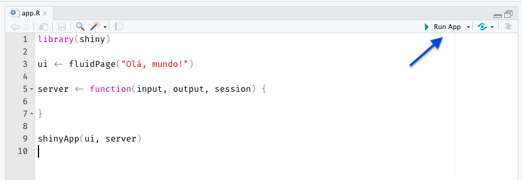
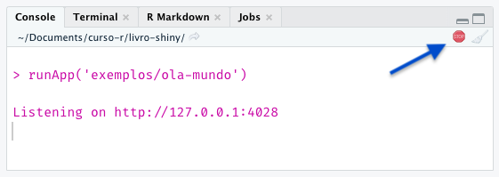

```{r, child="00-preamble.Rmd"}

```

## Componentes básicos

Um aplicativo Shiny tem dois componentes básicos: a **interface de usuário** e o **servidor**.

O primeiro componente se refere à construção do código HTML que compõe o app. Podemos pensar na programação desse código HTML como a construção daquilo que será mostrado na tela, a cara do seu app, a interface de usuário ou **UI** (sigla para o termo *user interface*, em inglês).

O segundo componente se refere àquilo que não será visto por quem utilizar o app: o **servidor**. O lado do servidor (*server side* ou simplesmente *server*, em inglês) contém toda a lógica para a construção das saídas apresentadas na UI.

---
## A UI

A figura a seguir mostra a UI de um app bem simples, que permite a escolha de duas variáveis e apresenta o gráfico de dispersão delas:

```{r, echo = FALSE}
knitr::include_graphics("img/app_penguins_disp.png")
```

---
## O servidor

Embora precisemos aprender alguns conceitos e regras novas, a maior parte do código que compõe o servidor é aquele bom e velho R que já utilizamos no dia-a-dia para gerar tabelas, gráficos e qualquer outro tipo de visualização. 

Em resumo, para fazer um ggplot aparecer no Shiny, basta adaptar o código que gera esse gráfico para receber as entradas de quem estiver usando o app (*inputs*) e devolver o resultado (*output*) no *lugar* adequado.

Na figura do slide anterior, o código que gera o gráfico de dispersão fica dentro do servidor.

---
## Juntando tudo...

```{r, echo = FALSE, out.width="90%"}
knitr::include_graphics("img/esquema_ui_servidor.png")
```

---
class: center, middle

## [Exemplo de Shiny app](https://cursodashboards.shinyapps.io/penguins-dispersao/)

---
## Estrutura de um código Shiny

O código de qualquer aplicativo em Shiny terá a estrutura abaixo:

- Um objeto chamado `ui`.

- Uma função chamada `server`.

- Uma chamada da função `shinyApp()`.

```{r, eval=FALSE}
library(shiny)

ui <- fluidPage("Olá, mundo!")

server <- function(input, output, session) {
  
}

shinyApp(ui, server)
```

---

## UI: o que o usuário vai ver

No objeto `ui`, construímos o que será mostrado na tela para o usuário. Nele, devemos:

- Construir o layout do aplicativo.

- Definir quais inputs serão utilizados (caixas de seleção, caixas de textos, seletores de data, slides etc).

- Definir quais visualizações serão mostradas (tabelas, gráficos, mapas etc).

Todas as funções que utilizarmos para criar o `ui` retornarão código HTML. O objeto `ui`, portanto, será um grande código HTML.

```{r, eval=FALSE}
ui <- fluidPage("Olá, mundo!")
#> <div class="container-fluid">Olá, mundo!</div>
```

**Neste contexto, serão sinônimos**: UI, interface de usuário, *front-end*, *front*.

---
## Server: onde a mágica acontece

A função `server()` vai receber nossos códigos R usuais de manipular bases, gerar tabelas, gráficos, mapas e qualquer outra visualização que quisermos construir.

A função `server()` sempre terá os parâmetros:

- `input`: uma lista com todos parâmetros que o usuário pode mexer.

- `output`: uma lista com todas as visualizações que vamos mostrar para o usuário.

- `session`: uma lista com informações da sessão que está rodando o aplicativo.

**Neste contexto, serão sinônimos**: server, servidor, *back-end*.

---
## Rodando um aplicativo

Normalmente, enquanto estamos desenvolvendo um aplicativo Shiny, queremos testá-lo localmente para verificar se tudo funciona corretamente, se está ficando bonito ou simplesmente para gastar alguns minutos apreciando a nossa obra de arte. Testar localmente significa que **o seu próprio computador fará as vezes de servidor**, embora isso não signifique que seu app ficará disponível na internet.

Quando servimos um app localmente, isto é, quando *rodamos um app*, ganhamos um endereço que será acessível apenas do nosso computador. A partir desse endereço, podemos testar nosso app no navegador, como se ele já estivesse em produção. 

No RStudio, podemos rodar nossos apps:

- rodando o script que contém o nosso app (atalho: `CTRL + SHIFT + ENTER`);

- clicando no botão **Run App** (no RStudio);

- rodando no console a função `runApp("caminho/ate/app.R)`.


---
## O botão Run App

```{r, echo = FALSE, fig.alt="Botão Run App no Rstudio. Fica logo acima do script."}

```

Ao clicar nesse botão, o seu navegador padrão será aberto e você verá a UI do nosso modesto app com apenas a frase "Olá, mundo!".

---
## Sessão ocupada

Se você voltar ao RStudio, eventualmente vai notar algo muito importante: a sua sessão de R estará ocupada! Isso acontece porque todo Shiny app precisa de uma sessão de R rodando por trás.

Essa sessão fornece a comunicação da UI (ou do nosso navegador) com o servidor e é responsável por atualizar as visualizações apresentadas na UI, sempre que alguém interagir com o app.

Apesar de o nosso app *Olá, mundo* não possuir interatividade, a estrutura necessária para que a interatividade aconteça ainda assim é criada pelo Shiny.

---
## Liberando a sessão e endereço do app

Para liberar a sessão, basta clicar no botão "*stop*", na parte de cima do Console, ou pressionar a tecla `Esc`. Veja que, ao fazer isso, a tela do app ficará acinzentada, indicando que ele foi desconectado do servidor e não funcionará mais corretamente.

```{r, echo = FALSE, fig.alt="Console do RStudio com sinal de ocupado (stop).", out.width="60%"}

```

Reparem que a mensagem no Console representa o *endereço* do nosso aplicativo. Nesse caso, será um IP (`http://127.0.0.1`) com alguma porta disponível escolhida aleatoriamente (`:4028`). Esse endereço aparecerá no nosso navegador e poderemos copiá-lo e colá-lo em qualquer outra aba ou navegador para abrir uma nova instância do app.
