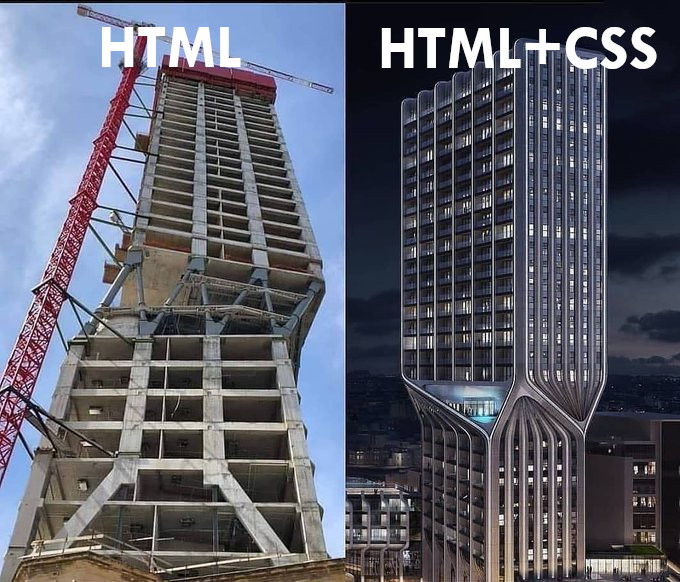

```{r, child="00-preamble.Rmd"}

```

## O que é Shiny?

**Shiny é um framework em linguagem R para a criação de aplicativos web.**

--

- **framework**: conjunto de conceitos e ferramentas.

--

- **aplicativo web**: uma página web que possui um programa/funcionalidade por trás.

---

## Páginas e aplicações web

Páginas web possuem o objetivo de comunicar uma informação via texto, imagens e vídeos.

- Blogs

- Páginas de notícias

- A Wikipedia

--

Aplicações web também podem ter esse objetivo, mas além disso, elas possuem alguma funcionalidade, executada por um programa que está sendo executado em tempo real.

- Sites de compra

- Sites de banco

- Aplicativos Shiny

---

## O que é Shiny?

Shiny é um **conjunto de conceitos e ferramentas** em linguagem R para a criação de **páginas web que possuem uma funcionalidade por trás**.

--

Um aplicativo Shiny pode ser reduzido a alguns elementos:

--

- uma página web: ele será acessado por um navegador, possuirá um endereço (URL) e será constituído por HTML, CSS e JavaScript.

--

- um aplicativo web: permitirá que quem estiver acessando intereja com as visualizações apresentadas.

--

- um código (ou uma coleção de códigos) em linguagem R: construídos, sobretudo, com o pacote `{shiny}`.

---
## HTML, CSS, JS... pra que serve?

Páginas e aplicações web são construídas em HTML, CSS, JS.

--

Se você não conhece essas linguagens, uma boa maneira de entender o papel de cada uma delas no desenvolvimento de um site é pensar na construção de um prédio.

.pull-left[

- Podemos pensar o HTML como a estrutura física do prédio: chão, paredes, colunas, teto, encanamento, fiação etc.

- O CSS é o responsável pela aparência: pintura, pisos, azulejos, decoração em geral.

- O JavaScript traz elementos de funcionalidade ao prédio: portas, janelas, interruptores, elevadores etc.

]

.pull-right[

```{r, echo = FALSE}

```


]


---
## Shiny: programando em HTML sem saber HTML

Com o Shiny, podemos produzir aplicativos web em HTML, CSS e JavaScript sem saber programar nessas linguagens. 

**E melhor: sem sair do R!**

<br><br>


<center>


<br>
<span style = "font-size: 10pt">
Fonte: <a href = http://www.rstudio.com/shiny/>rstudio.com/shiny/</a>
</span>
</center>

